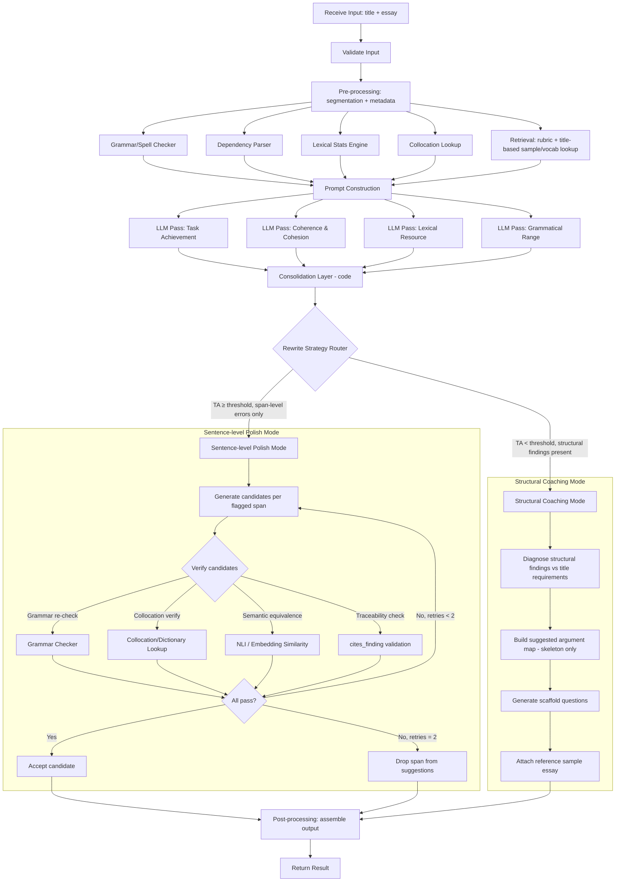

# IELTS Writing Tutor Agent

An AI agent that takes a **Task 2 essay title and student-written essay** as input and produces IELTS band scoring, strength/error analysis, sentence-level rewriting suggestions, and topic-matched reference material — grounded in deterministic NLP tools and curated retrieval, not raw LLM judgment alone.

---

## Table of Contents

1. [Overview](#overview)
2. [Agent Responsibilities](#agent-responsibilities)
3. [Input Specification](#input-specification)
4. [Output Specification](#output-specification)
5. [Processing Workflow](#processing-workflow)
6. [Internal Reasoning](#internal-reasoning)
7. [Prompt Design](#prompt-design)
8. [Validation](#validation)
9. [Error Handling](#error-handling)
10. [Design Decisions](#design-decisions)
11. [Evaluation](#evaluation)
12. [Future Improvements](#future-improvements)
13. [Appendix](#appendix)

---

## Overview

### Purpose

Provide IELTS Writing Task 2 candidates with examiner-grade feedback that is **consistent, explainable, and actionable** — not just a number, but a path to the next band.

### Business Goal

Replace (or scale) 1:1 human tutoring feedback for self-study platforms, reducing per-essay review cost while keeping feedback quality close to a certified IELTS examiner.

### Problem Statement

Raw LLM scoring of IELTS essays suffers from three failure modes that make it unsafe to ship as-is:

| Failure mode | Symptom |
|---|---|
| Score instability | Same essay scored differently across runs (±0.5–1.0 band) |
| Error hallucination | Model invents grammar errors that don't exist, or misses real ones |
| Generic feedback | Advice is templated / not tied to the student's actual text or level |

### Scope

- Task 2 (argumentative/opinion) essays only, English language input.
- Single-essay, single-turn analysis (no multi-draft conversation tracking in v1).
- Title is assumed **human-authored and valid** — the agent does not need to independently verify the title represents a legitimate IELTS prompt.

### Non-goals

- ❌ Task 1 (report/letter) essays.
- ❌ Speaking or Listening modules.
- ❌ Long-term learner progress tracking / personalization (explicitly out of scope for this version — see [Future Improvements](#future-improvements)).
- ❌ Plagiarism / AI-generated-essay detection.

---

## Agent Responsibilities

**The agent IS responsible for:**

- Scoring the essay against the 4 official IELTS Task 2 criteria (TA, CC, LR, GRA) + overall band.
- Extracting and evaluating argument coverage against the title (Task Achievement).
- Detecting strengths: collocations, topic vocabulary, linking devices, complex structures.
- Detecting errors: lexical (spelling/misuse), grammatical, repetition.
- Producing sentence-level, verified rewrite suggestions toward a target band.
- Retrieving a matching high-band sample essay and topic vocabulary list for the given title.

**The agent is NOT responsible for:**

- Deciding whether the *title itself* is a valid/well-formed IELTS prompt (assumed pre-validated by a human).
- Determining factual/argumentative "truth" of the student's opinion — IELTS TA does not require factual correctness, only logical support.
- Persisting or reasoning over the student's history across multiple essays (no personalization in this version).
- Making the final human-facing UI/UX decisions — the agent returns structured data; rendering is a downstream concern.

---

## Input Specification

| Field | Type | Required | Description | Example |
|---|---|---|---|---|
| `title` | string | ✅ | The IELTS Task 2 prompt, human-authored and pre-validated. | `"Some people believe that unpaid community service should be a compulsory part of high school programmes. To what extent do you agree or disagree?"` |
| `essay` | string | ✅ | Full student essay text, plain text (paragraph breaks preserved via `\n\n`). | `"In recent years, ..."` |
| `target_band` | float | ❌ (default: `current_band + 0.5`) | Desired band for rewrite suggestions. Computed after scoring if omitted. | `7.0` |
| `language` | string | ❌ (default: `"en"`) | Input language code. Non-English input is rejected (see [Validation](#validation)). | `"en"` |

> **Note:** `target_band` cannot be validated at input time since it depends on the *scored* band — validation for it happens post-scoring, not pre-processing.

---

## Output Specification

| Field | Type | Description | Example |
|---|---|---|---|
| `overall_band` | float | Weighted average of 4 criteria, rounded per IELTS half-band rules. | `6.5` |
| `criteria_scores` | object | Per-criterion score (0–9) + advice. | see JSON below |
| `strengths` | array | Highlighted collocations, vocabulary, linking devices, complex structures with span positions. | see JSON below |
| `errors` | array | Lexical/grammatical/repetition errors with position, explanation, and fix. | see JSON below |
| `rewrite_suggestions` | array | Sentence-level upgrade candidates (2–3 options each), verified before return. | see JSON below |
| `reference_material` | object | Matched sample essay + topic vocabulary list. | see JSON below |

```json
{
  "overall_band": 6.5,
  "criteria_scores": {
    "task_achievement": { "score": 6.5, "advice": "You address both sides but the conclusion does not clearly restate your position." },
    "coherence_cohesion": { "score": 7.0, "advice": "Good paragraph structure; linking devices are slightly repetitive (see repetition report)." },
    "lexical_resource": { "score": 6.0, "advice": "Vocabulary is accurate but relies on common words; few topic-specific terms used." },
    "grammatical_range": { "score": 6.5, "advice": "Mix of simple and complex sentences; recurring article errors with uncountable nouns." }
  },
  "strengths": [
    { "type": "collocation", "text": "play a crucial role", "span": [120, 141] },
    { "type": "linking_device", "text": "Furthermore", "span": [310, 321] }
  ],
  "errors": [
    { "type": "grammatical", "subtype": "article", "text": "informations", "span": [402, 415], "issue": "Uncountable noun used with plural marker.", "fix": "information" },
    { "type": "repetition", "text": "important", "count": 4, "spans": [[88,97], [250,259]] }
  ],
  "rewrite_suggestions": [
    {
      "original_span": [402, 470],
      "original_text": "There are many informations that support this idea.",
      "options": [
        "A substantial body of evidence supports this idea.",
        "This idea is backed by a wide range of evidence."
      ],
      "reason": "Fixes uncountable noun error and removes vague quantifier 'many'."
    }
  ],
  "reference_material": {
    "sample_essay_id": "env-014-band8",
    "vocabulary_list": [
      { "term": "compulsory volunteering", "definition": "Mandatory unpaid work required by an institution." }
    ]
  }
}
```

---

## Processing Workflow

### Step-by-step

```
Receive Input (title, essay)
        ↓
Validate Input
        ↓
Pre-processing (sentence/paragraph segmentation, metadata)
        ↓
Deterministic Tool Pass (parallel: grammar, spellcheck, dependency parse, lexical stats, collocation lookup)
        ↓
Retrieval (static rubric injection + key-based lookups + title→sample/vocab lookup)
        ↓
Prompt Construction (4 independent criterion prompts)
        ↓
LLM Reasoning (4 parallel scoring passes: TA / CC / LR / GRA)
        ↓
Structured Output Parsing (JSON schema validation per pass)
        ↓
Consolidation (merge 4 outputs, resolve span-level conflicts) — code, not LLM
        ↓
Rewriting Layer (LLM generative + tool-based self-verification loop)
        ↓
Post-processing (assemble final JSON, attach reference material)
        ↓
Return Result
```

### Mermaid Flowchart



---

## Internal Reasoning

> **Note:** The stages below describe *what* each reasoning step must accomplish, not a literal chain-of-thought to expose to the model or user.

### Per-criterion scoring passes (TA / CC / LR / GRA)

1. **Understand the prompt** — parse the title's argument requirement (agree/disagree, discuss both views, advantages/disadvantages, etc.).
2. **Analyze the essay against the assigned criterion only** — e.g., the GRA pass reasons about sentence structures and error patterns, not vocabulary richness.
3. **Compare against band descriptors** (injected in context) — anchor judgment to the official descriptor language for bands 5–9.
4. **Cross-check against deterministic tool output** — grammar/lexical findings from Layer 1 are treated as ground truth to explain, not to re-derive.
5. **Assign a score** — justified by descriptor match, not by "feel."
6. **Generate advice** — tied to specific spans in the essay, phrased as actionable next steps.

### Rewriting pass

1. Read the consolidated, annotated essay (all 4 criteria's findings merged).
2. Identify only flagged spans — do not rewrite unflagged sentences.
3. Draft candidate replacement(s) aimed at the target band descriptor.
4. Verify each candidate against deterministic tools (grammar, collocation) before returning.
5. Attach a plain-language reason for each suggestion, drawn from the original finding.

---

## Prompt Design

| Component | Purpose | Why it exists |
|---|---|---|
| **System Prompt** | Defines the model's role (e.g., "You are an IELTS examiner scoring Task Achievement only") | Narrows scope to one criterion — prevents cross-criterion bleed and reduces reasoning load |
| **Band Descriptors** | Official IELTS descriptor text for the assigned criterion, bands 5–9 | Anchors scoring to an external, authoritative rubric instead of the model's implicit training-data notion of "good writing" |
| **Few-shot Examples** | 2–4 essays with known, examiner-verified scores for the same criterion | Calibrates the boundary between adjacent bands (e.g., what separates 6.5 from 7.0) — descriptors alone are too abstract |
| **Deterministic Tool Findings** | Structured output from grammar checker, dependency parser, lexical stats | Gives the model verified facts to *interpret*, instead of asking it to *detect* errors from scratch (reduces hallucination) |
| **Constraints** | E.g., "Only comment on spans provided; do not invent errors not present in tool output" | Explicit guardrail against hallucinated errors |
| **Output Format / JSON Schema** | Strict schema definition with required fields and types | Enables reliable downstream parsing without a text-parsing layer; a schema violation is caught immediately rather than silently corrupting output |

### Example prompt skeleton (Grammatical Range & Accuracy pass)

```text
SYSTEM:
You are an IELTS examiner. Score ONLY the Grammatical Range & Accuracy (GRA)
criterion for the essay below, following the official band descriptors provided.
Do not comment on vocabulary, coherence, or task achievement.

BAND DESCRIPTORS (GRA, bands 5-9):
<descriptor text injected here>

FEW-SHOT CALIBRATION:
<2-4 essay excerpts with known GRA band + justification>

DETECTED GRAMMAR ISSUES (from tool, ground truth — do not re-derive, only interpret):
<list of {span, error_type, suggested_fix} from Layer 1>

CONSTRAINTS:
- Only reference errors present in the detected issues list above.
- Score must be one of: 4.0, 4.5, 5.0 ... 9.0
- Output must strictly match the JSON schema below.

OUTPUT SCHEMA:
{ "score": float, "advice": string, "errors_referenced": [span_ids] }

ESSAY:
<student essay text>
```

---

## Validation

| Rule | Trigger | Action |
|---|---|---|
| Missing essay | `essay` field empty or null | Reject with `400` — cannot score |
| Invalid title | `title` field empty | Reject — TA scoring requires a prompt to compare against |
| Too few words | `essay` word count < 150 (IELTS Task 2 minimum) | Reject with warning; scoring below minimum is not meaningful under IELTS rules |
| Too many words unusually | `essay` word count > ~600 without paragraph structure | Warn but proceed — not a hard reject |
| Wrong task type | Heuristic/format check suggests Task 1 (e.g., references to charts/graphs/data trends) | Reject — out of scope |
| Unsupported language | Language detector confidence for non-English > threshold | Reject with `422` |
| JSON schema violation (per LLM pass) | Output fails schema validation | Retry pass once with corrective instruction; if still invalid, mark criterion as `"status": "failed"` and surface to consolidation |

---

## Error Handling

| Failure | Cause | Detection | Expected Response | Recovery Strategy |
|---|---|---|---|---|
| Grammar tool timeout | External API/service latency or outage | Timeout exception on tool call | Proceed with reduced context; flag `"grammar_check": "degraded"` in metadata | Retry once with backoff; if still failing, LLM pass proceeds without tool ground-truth but with lowered confidence flag |
| LLM returns malformed JSON | Model deviates from schema | JSON parse/schema validation failure | Do not surface to user | Single retry with explicit "your last output was invalid, return only valid JSON matching schema" instruction |
| Score inconsistency across retries | Model non-determinism | Self-consistency check detects variance > 0.5 band across N runs | Do not auto-resolve silently | Take median score; log variance for QA review; if variance persists, flag essay for human review |
| No matching sample essay for title | Corpus lacks a tagged match for the topic | Lookup returns empty result | Do not fail whole request | Fall back to nearest topic-cluster match (secondary lookup); if none, omit `reference_material.sample_essay_id` and note absence |
| Rewrite introduces a new error | Model "fixes" one issue while creating another | Post-generation verification pass (grammar/collocation re-check) fails | Do not return unverified rewrite | Regenerate (max 2 retries); if still failing, drop that specific suggestion rather than blocking the whole response |
| Essay in mixed language | Partial non-English content | Language detector flags segments | Reject or flag depending on severity threshold | Return validation error with segment location |

---

## Design Decisions

### Decision 1 — Deterministic tools run as a fixed pipeline, not agent-invoked tools

- **Reason:** Every essay requires grammar/lexical/dependency analysis unconditionally — there is no decision to make about *whether* to run them, so agentic tool-calling adds latency and non-determinism with no benefit.
- **Alternative:** Let the LLM decide when to call each tool (fully agentic).
- **Trade-off:** Fixed pipeline sacrifices flexibility for edge cases the pipeline didn't anticipate, in exchange for speed, cost, and reproducibility — accepted trade-off given the task is well-defined and repetitive.

### Decision 2 — Retrieval is not a single vector-DB layer; it is mixed by data type

- **Reason:** Band descriptors, collocation checks, and title→sample-essay/vocab mappings are exact-match or small-and-fixed — vector similarity search adds cost and mismatch risk (semantically "similar" but topically wrong) without benefit.
- **Alternative:** One unified vector DB for all retrieval needs.
- **Trade-off:** Mixed retrieval requires maintaining multiple lookup mechanisms (static injection, key-value store, tag-based lookup) instead of one system, but each mechanism is simpler and more predictable individually.

### Decision 3 — Four criteria are scored via four parallel LLM calls on one shared model, not four separate fine-tuned models

- **Reason:** A single strong general-purpose model with criterion-specific prompts, rubric injection, and few-shot calibration achieves sufficient specialization without the cost/maintenance overhead of four fine-tuned models.
- **Alternative:** Fine-tune one model per criterion.
- **Trade-off:** Slightly less specialization ceiling in exchange for far lower maintenance cost and faster iteration on prompts/rubrics.

### Decision 4 — Rewriting is a separate, sequential layer after all 4 scoring passes, not a 5th parallel pass

- **Reason:** Rewriting must reconcile findings across all 4 criteria (e.g., a sentence flagged by GRA must not be rewritten in a way that breaks a strength flagged by CC) — this requires the consolidated view, which doesn't exist until scoring completes.
- **Alternative:** Run rewriting in parallel with scoring, based only on raw essay text.
- **Trade-off:** Adds latency (sequential dependency) but eliminates the risk of contradictory or overlapping edits.

### Decision 5 — No dedicated "Pedagogy Synthesis" LLM layer

- **Reason:** Explanatory feedback (Modules 1–3) is generated directly by each scoring pass as structured fields (`advice`, `strengths`, `errors`); rewriting (Module 4) is handled by the Rewriting Layer. A separate synthesis LLM call would duplicate work already produced by existing passes.
- **Alternative:** Add a 5th LLM call to "tie everything together" into narrative feedback.
- **Trade-off:** None significant — this was pure redundancy removal. If future personalization requires narrative synthesis across sessions, it should be reintroduced as a lightweight prompt-injection into existing passes, not a new layer.

---

## Evaluation

| Metric | Definition | Target |
|---|---|---|
| **Band Accuracy** | Mean absolute difference vs. certified human examiner score on held-out test set | ≤ 0.5 band |
| **Human Agreement** | % of essays where AI band is within ±0.5 of human examiner | ≥ 85% |
| **JSON Validity** | % of LLM responses parsing without retry | ≥ 98% |
| **Latency** | End-to-end time from input to final result | ≤ 8s (parallel passes) |
| **Cost** | Total token cost per essay (4 scoring calls + rewriting) | Tracked per release, budget-capped |
| **Consistency** | Score variance across 3 repeated runs of the same essay | ≤ 0.25 band std. dev |
| **Determinism (tool layer)** | Identical output from Layer 1 tools across repeated runs on the same input | 100% (must be exact) |
| **Rewrite Safety** | % of rewrite suggestions passing post-generation verification without introducing new errors | 100% (hard requirement — failing suggestions must be dropped, not returned) |

---

## Future Improvements

**Priority 1 (near-term)**
- Reintroduce **learner personalization**: persist recurring error patterns across sessions to tailor advice and rewrite emphasis.
- Expand sample essay / vocabulary corpus coverage per topic cluster to reduce fallback-lookup misses.

**Priority 2 (mid-term)**
- Add **cross-criterion conflict resolution logic** in Consolidation Layer (e.g., confidence-weighted arbitration when two passes disagree on the same span).
- Multi-draft comparison: track score/error delta across successive submissions of the same essay.

**Priority 3 (longer-term)**
- Support Task 1 (charts/reports) as a parallel agent sharing the deterministic tool layer.
- Fine-tune a dedicated grammar-error-explanation model to reduce dependency on general-purpose LLM cost for high-volume, low-complexity explanation generation.

---

## Appendix

### Example Input

```json
{
  "title": "Some people believe that unpaid community service should be a compulsory part of high school programmes. To what extent do you agree or disagree?",
  "essay": "In recent years, ... [full essay text, 250+ words]",
  "target_band": 7.0
}
```

### Example Output

See full JSON example in [Output Specification](#output-specification).

### Sample Prompt (Task Achievement pass)

```text
SYSTEM:
You are an IELTS examiner. Score ONLY Task Achievement (TA) for the essay
below against the given title. Follow the official TA band descriptors.

TITLE:
"Some people believe that unpaid community service should be a compulsory
part of high school programmes. To what extent do you agree or disagree?"

BAND DESCRIPTORS (TA, bands 5-9):
<descriptor text>

FEW-SHOT CALIBRATION:
<examples>

CONSTRAINTS:
- Evaluate only whether the essay addresses all parts of the prompt and
  presents a clear, developed position.
- Do not comment on grammar or vocabulary.
- Output must match the JSON schema exactly.

OUTPUT SCHEMA:
{ "score": float, "advice": string, "coverage_notes": [string] }

ESSAY:
<student essay text>
```

### Sample JSON (Consolidation Layer internal representation)

```json
{
  "sentences": [
    {
      "index": 12,
      "span": [402, 470],
      "text": "There are many informations that support this idea.",
      "findings": [
        { "criterion": "GRA", "type": "error", "subtype": "article", "detail": "Uncountable noun 'information' used with plural marker." },
        { "criterion": "LR", "type": "note", "detail": "Vague quantifier 'many' — could use more precise academic phrasing." }
      ],
      "priority_conflict": false
    }
  ]
}
```
